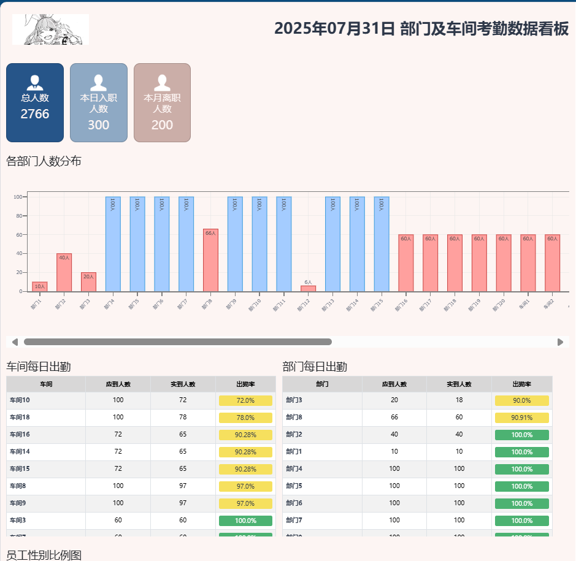

SPDX-License-Identifier: MIT

# Python_attendance-display

## 📖 写在最前面
> 该项目基于 Python 3.10.8 开发，使用 Dash 最为 web 前端框架，公司logo已替换。
> UI 基于特定展板硬件设计，请勿用于其他用途。

---

## ⚙️ 介绍
> 一个基于 Excel 数据的 web 看板/报表

---

## 📌 主要功能
- ✅ 功能 1：基于 Excel 中的数据展示公司员工组成，各部门出勤率（自动排序）等

---

## 🆕 最近更新
| 日期 | 版本 | 变更摘要 |
|------|------|----------|
| 2025-07-28 | v1.1.0 | 修改替换敏感内容 |

---

## 🛠️ 技术栈
- Python Dash

---

## 🚀 快速开始
1. 克隆仓库  
   ```bash
   git clone https://github.com/yijiu2333/Python_attendance-display.git
   cd Python_attendance-display
   ```

2. 安装依赖
   ```bash
   python -m venv venv
   venv\Scripts\activate
   pip install -r requirements.txt
   ```

3. 本地启动
   ```bash
   python mainpage.py

   ```

4. 打开浏览器访问
    http://127.0.0.1:8050/

---

## 🖼️ 程序总览
   

---

## 🚫 版权说明
   - 本项目仅供学习/作品集展示，请勿用于任何商业用途。
   - 使用限制：本项目仅供学习/作品集展示，内部包含的非商用资源（如示例图标、图片、字体。UI组件等）请自行替换后方可用于商业场景。
   - json文件中均为虚拟数据，仅用于程序功能展示，纯属虚构，不代表真实情况。

---

## 📄 许可证
   - [MIT](./LICENSE) © 2025 Yijiu Zhao